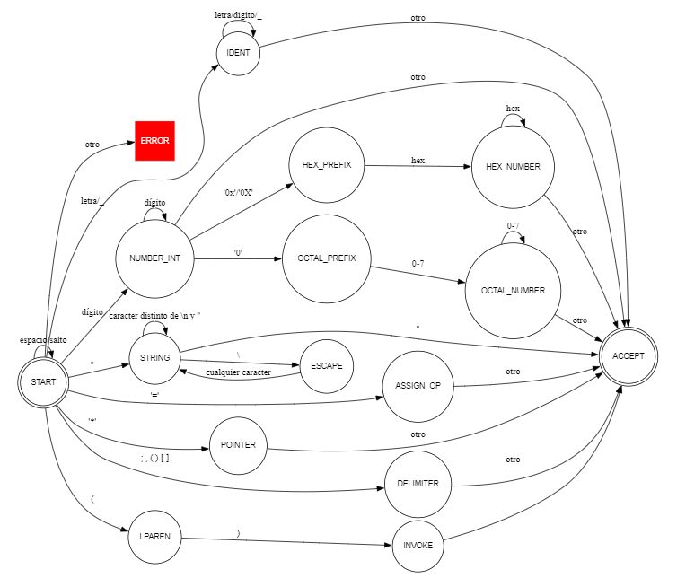

# Scanner y Parser de Declaraciones en C

## Scanner

El **Scanner** es el primer paso de un Compilador que lee el código fuente y lo convierte en una secuencia de Tokens (componentes léxicos), que son las unidades más pequeñas y significativas del código fuente. Luego, el Parser (analizador sintáctico) toma esta lista de tokens y verifica que estén en el orden correcto según las reglas/especificaciones del lenguaje.

## Objetivo

Un Scanner recibe una secuencia de caracteres y producir la secuencia de tokens necesarios para declaraciones: tipos y "qualifiers" (como literales), identificadores, literales numéricos, char/string, símbolos `* ( ) [ ] { } , ; = : ...` y espacios (descartables). Reconoce IDENT y luego compara con la lista de keywords del lenguaje para reclasificar.

## Tokens e Identificadores

### Tipos y Keywords:

`int`, `char`, `short`, `long`, `float`, `double`, `void`, `signed`, `unsigned`, `typedef`, `struct`, `union`, `enum`, `const`, `volatile`, `static`, `extern`, `register`, `inline`, `restrict`, `_Bool`, `_Complex`, `_Atomic`, `_Noreturn`

### Identificadores y Literales:

- IDENT — nombre: `[A-Za-z_][A-Za-z0-9_]*` (letra o `_` + letras/dígitos/_).

- NUMBER_INT — enteros: decimal (`0` ó `[1-9][0-9]*`), octal (`0` + `[0-7]+`), hexadecimal (`0x[0-9a-fA-F]+`).

- NUMBER_FLOAT — flotantes: `123.45`, `.5`, `1e-3` (fración y/o exponente).

- CHAR_LITERAL — `'a'` o escapes como `'\n'`.

- STRING_LITERAL — `"texto"` con escapes (`\"`, `\\`).

- KEYWORDS 

- SIMBOLOS — `* ( ) [ ] , ; : = ... & + - / % << >> == !=` (los que permitas).

- WS — `[ \t\r\n]+` (espacio descartable).

- ERROR — literal mal formado / EOF en string/char.

## Expresiones Regulares / RegEx

* Espacios:
    - WS: `[ \t\r\n]+`

* Identificador:
    - IDENT: `[A-Za-z_][A-Za-z0-9_]*`
Primero todo se lee como IDENT, y luego se reclasifica si es una Keyword.

* Literales Numéricos:
    - HEX_INT : `0[xX][0-9a-fA-F]+`
    - OCT_INT : `0[0-7]+`
    - DEC_INT : `0|[1-9][0-9]*`
    - NUMBER_FLOAT : `([0-9]+\.[0-9]*|\.[0-9]+)([eE][+-]?[0-9]+)?|[0-9]+[eE][+-]?[0-9]+`
    - NUMBER_INT : `HEX_INT|OCT_INT|DEC_INT`

* Literales
    - CHAR_LITERAL : `'(\\.|[^'\\])'`
    - STRING_LITERAL : `"(\\.|[^"\\])*"`

* Símbolos y Operadores:
    - ASTERISCO: `*`
    - L_PARENTESIS: `(`
    - R_PARENTESIS: `)`
    - L_BRACKET: `[`
    - R_BRACKET: `]`
    - COMA: `,`
    - PUNTOCOMA: `;`
    - ASIGNACION: `=`

## Definición BNF

La notación de Backus-Naur o, por sus denominaciones inglesas, Backus-Naur Form, Backus-Naur Formalism o Backus Normal Form, es un metalenguaje usado para expresar gramáticas libres de contexto; es decir, una manera formal de describir lenguajes formales.

Termina siendo un sistema de reglas de derivación, escrito como:
```
<unidad> ::= <expresion> | (<expresion-opcional>)
```  
O:
```
unidad :
      expresion
    | (expresion-opcional)
```

donde `unidad` es un **no-terminal**, `::=` / `:` se lee como "se define como" o "produce", y la "expresion", "expresion-opcional", consiste en secuencias de símbolos o secuencias separadas por la barra vertical `|`, indicando una "opcion", el conjunto es una posible substitución para el símbolo a la izquierda. Los símbolos que nunca aparecen en un lado izquierdo son **terminales**.

## Definición Máquina de Estados (Autómata Finito)



## Formalización

### Estados **Q**:
```
Q = {
    START, 
    IDENT, 
    NUMBER_INT, 
    HEX_PREFIX, 
    HEX_NUMBER, 
    OCTAL_PREFIX, 
    OCTAL_NUMBER, 
    STRING, 
    ESCAPE, 
    ASSIGN_OP, 
    POINTER, 
    DELIMITER, 
    ACCEPT, 
    ERROR
}
```

### Estado Inicial **Qo**:
```
Qo = START
```

### Conjunto **Σ** / Alfabeto:
```
Σ = { 
    LETRA/_    // A–Z a–z y _
    DIGITO_1_9 // 1-9
    CERO       // 0
    xX         // x o X (para 0x)
    HEX        // 0-9 a-f A-F
    PUNTO      // .
    COMILLA_D  // "
    COMILLA_S  // '
    BACKSLASH  // Barra invertida \
    ESP        // espacio / tab / salto de línea ([ \t\r\n])
    SIM        // símbolos válidos inicio operador/delimitador (* ( ) [ ] { } , ; : = + - / % < > ! . etc.)
    OTRO       // cualquier otro carácter ASCII no incluido arriba    
}
```

## Parser

El **Parser** (analizador sintáctico) es la etapa del compilador que toma la secuencia de tokens generada por el Scanner y verifica que esos tokens formen construcciones válidas según la gramática del lenguaje. 

## Objetivo

Su trabajo no es leer caracteres sino interpretar tokens: aplicar reglas sintácticas para reconocer declaraciones, construir una representación estructurada (como un árbol de derivación) y detectar errores sintácticos.

## BNF Parser
```
UT :
      declaracion
    | UT declaracion
    ;

declaracion : 
    tipo declarador TOKEN_SEMICOLON ;

tipo : 
      TOKEN_IDENT
    | KEYWORD
    ;

declarador :   
    (secuencia-punteros) declarador-directo ;

secuencia-punteros :     
    TOKEN_ASTERISK (secuencia-punteros) ;


declarador-directo : 
      TOKEN_LPAREN declarador TOKEN_RPAREN 
    TOKEN_IDENT 
    | declarador-directo TOKEN_LBRACKET expresion TOKEN_RBRACKET 
    | declarador-directo TOKEN_LPAREN (parametros) TOKEN_RPAREN
    ;

expresion : 
      NUMBER_INT 
    | TOKEN_IDENT
    ;

parametros : 
    parametro ( COMMA parametro ) ;

parametro : 
    tipo (declarador) ;

NUMBER_INT : 
      TOKEN_INT_DEC 
    | TOKEN_INT_HEX 
    | TOKEN_INT_OCTAL
    ;

KEYWORD : 
    int | char | short | long | float | double | void | signed | unsigned | typedef | struct | unión | enum | const | volatile | static | extern | register | inline | restrict | _Bool | _Complex | _Atomic | _Noreturn
    ;
```
